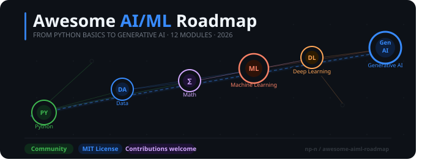

# AI/ML Roadmap

> A curated, community-maintained collection of the **best free and paid resources** to learn every topic in the [AI/ML Roadmap for Beginners 2026](https://netraneupane.medium.com/ai-ml-roadmap-for-beginners-2026-4e359a94e494) — from Python basics all the way to Generative AI.

---

## The Roadmap

*Source: [AI/ML Roadmap for Beginners 2026 — Netra Neupane on Medium](https://netraneupane.medium.com/ai-ml-roadmap-for-beginners-2026-4e359a94e494)*

---

## Legend

| Icon | Type                   |
| ---- | ---------------------- |
| 📺   | YouTube Video          |
| 📄   | Article / Blog Post    |
| 📘   | Official Documentation |
| 🎓   | Free Course            |
| 💰   | Paid Course / Book     |

Resources within each topic are sorted **Beginner → Intermediate → Advanced**.

---

## Table of Contents

- [Module 1: Python Programming](#module-1-python-programming)
- [Module 2: Data Foundation](#module-2-data-foundation)
- [Module 3: Basic Data Pre-processing](#module-3-basic-data-pre-processing)
- [Module 4: Math Foundations](#module-4-math-foundations)
- [Module 5: ML Foundations](#module-5-ml-foundations)
- [Module 6: ML Core Concepts](#module-6-ml-core-concepts)
- [Module 7: Database &amp; Engineering Basics](#module-7-database--engineering-basics)
- [Module 8: Deep Learning](#module-8-deep-learning)
- [Module 9: Natural Language Processing (NLP)](#module-9-natural-language-processing-nlp)
- [Module 10: Generative AI](#module-10-generative-ai)
- [Module 11: Evaluation, Responsible AI &amp; Monitoring](#module-11-evaluation-responsible-ai--monitoring)
- [Module 12: Capstone Projects](#module-12-capstone-projects)

---

## Module 1: Python Programming

### Python Fundamentals

- 📘 [The Python Tutorial — Official Docs](https://docs.python.org/3/tutorial/index.html) `Beginner`
- 📺 [Python Tutorials for Beginners — Corey Schafer](https://www.youtube.com/playlist?list=PL-osiE80TeTt2d9bfVyTiXJA-UTHn6WwU) `Beginner`
- 📺 [Learn Python — Full Course for Beginners — freeCodeCamp](https://www.youtube.com/watch?v=rfscVS0vtbw) `Beginner`
- 🎓 [CS50P: Introduction to Programming with Python — Harvard](https://cs50.harvard.edu/python/2022/) `Beginner` *(Free)*
- 📘 [Control Flow Tools (loops, functions) — Python Docs](https://docs.python.org/3/tutorial/controlflow.html) `Beginner`
- 📘 [Data Structures (lists, dicts, sets) — Python Docs](https://docs.python.org/3/tutorial/datastructures.html) `Intermediate`
- 💰 [Automate the Boring Stuff with Python — Al Sweigart](https://automatetheboringstuff.com/) `Intermediate` *(Free to read online)*

### OOP in Python

- 📺 [Object-Oriented Programming — Corey Schafer](https://www.youtube.com/playlist?list=PL-osiE80TeTsqhIuOqKhwlXsIBIdSeYtc) `Beginner`
- 📘 [Classes — Python Official Tutorial (Ch. 9)](https://docs.python.org/3/tutorial/classes.html) `Intermediate`
- 📄 [OOP in Python — Real Python](https://realpython.com/python3-object-oriented-programming/) `Intermediate`
- 📘 [dataclasses — Auto-generate `__init__`, `__repr__` — Python Docs](https://docs.python.org/3/library/dataclasses.html) `Advanced`
- 📄 [Python Magic Methods — Real Python](https://realpython.com/python-magic-methods/) `Advanced`

### Decorators and Generators

- 📺 [Decorators — Corey Schafer](https://www.youtube.com/watch?v=FsAPt_9Bf3U) `Intermediate`
- 📄 [Primer on Python Decorators — Real Python](https://realpython.com/primer-on-python-decorators/) `Intermediate`
- 📺 [Generators — Corey Schafer](https://www.youtube.com/watch?v=bD05uGo_sVI) `Intermediate`
- 📄 [Python Generators — Real Python](https://realpython.com/introduction-to-python-generators/) `Intermediate`
- 📘 [Functional Programming HOWTO — Python Docs](https://docs.python.org/3/howto/functional.html) `Advanced`

### Exception Handling & Logging

- 📘 [Errors and Exceptions — Python Docs](https://docs.python.org/3/tutorial/errors.html) `Beginner`
- 📄 [Python Exceptions — Real Python](https://realpython.com/python-exceptions/) `Beginner`
- 📘 [Logging HOWTO — Python Docs](https://docs.python.org/3/howto/logging.html) `Intermediate`
- 📄 [Logging in Python — Real Python](https://realpython.com/python-logging/) `Intermediate`
- 📘 [logging — Python Standard Library Reference](https://docs.python.org/3/library/logging.html) `Advanced`

### File Handling

- 📘 [Input and Output — Python Docs (Ch. 7)](https://docs.python.org/3/tutorial/inputoutput.html) `Beginner`
- 📄 [Reading and Writing Files — Real Python](https://realpython.com/read-write-files-python/) `Beginner`
- 📺 [File Objects — Corey Schafer](https://www.youtube.com/watch?v=Uh2ebFW8OYM) `Beginner`
- 📘 [csv — CSV File Reading &amp; Writing — Python Docs](https://docs.python.org/3/library/csv.html) `Intermediate`
- 📘 [sqlite3 — SQLite Database Interface — Python Docs](https://docs.python.org/3/library/sqlite3.html) `Intermediate`

### Writing Clean, Modular Code

- 📄 [PEP 8 — Style Guide for Python Code](https://peps.python.org/pep-0008/) `Beginner`
- 📄 [Python Code Quality — Real Python](https://realpython.com/python-code-quality/) `Intermediate`
- 📄 [Python Application Layouts — Real Python](https://realpython.com/python-application-layouts/) `Intermediate`
- 📘 [typing — Type Hints for Readable Code — Python Docs](https://docs.python.org/3/library/typing.html) `Intermediate`
- 💰 [Clean Code in Python — Mariano Anaya (Book)](https://www.packtpub.com/product/clean-code-in-python-second-edition/9781800560215) `Advanced` *(Paid)*

### Problem Solving with Python

- 🎓 [HackerRank Python Practice](https://www.hackerrank.com/domains/python) `Beginner` *(Free)*
- 🎓 [Exercism Python Track](https://exercism.org/tracks/python) `Beginner` *(Free)*
- 🎓 [CS50P Problem Sets — Harvard](https://cs50.harvard.edu/python/2022/) `Intermediate` *(Free)*
- 🎓 [LeetCode — Easy Python Problems](https://leetcode.com/problemset/all/?difficulty=EASY) `Intermediate` *(Free)*

---

## Module 2: Data Foundation

### NumPy

- 📘 [NumPy: Absolute Basics for Beginners](https://numpy.org/doc/stable/user/absolute_beginners.html) `Beginner`
- 📘 [NumPy Quickstart Tutorial](https://numpy.org/doc/stable/user/quickstart.html) `Beginner`
- 📺 [NumPy Tutorial for Beginners — freeCodeCamp](https://www.youtube.com/watch?v=QUT1VHiLmmI) `Beginner`
- 📘 [Indexing on ndarrays — NumPy User Guide](https://numpy.org/doc/stable/user/basics.indexing.html) `Intermediate`
- 📘 [NumPy User Guide](https://numpy.org/doc/stable/user/index.html) `Intermediate`
- 📘 [NumPy Reference (full API)](https://numpy.org/doc/stable/reference/index.html) `Advanced`

### Pandas

- 📘 [10 Minutes to Pandas](https://pandas.pydata.org/docs/user_guide/10min.html) `Beginner`
- 📘 [Getting Started Tutorials — Pandas Docs](https://pandas.pydata.org/docs/getting_started/intro_tutorials/index.html) `Beginner`
- 📺 [Pandas Tutorials — Corey Schafer](https://www.youtube.com/playlist?list=PL-osiE80TeTsWmV9i9c58mdDCSskIFdDS) `Beginner`
- 🎓 [Kaggle: Pandas](https://www.kaggle.com/learn/pandas) `Beginner` *(Free)*
- 📘 [Group By: split-apply-combine — Pandas Docs](https://pandas.pydata.org/docs/user_guide/groupby.html) `Intermediate`
- 📘 [Merge, Join, Concatenate — Pandas Docs](https://pandas.pydata.org/docs/user_guide/merging.html) `Intermediate`
- 💰 [Python for Data Analysis — Wes McKinney](https://wesmckinney.com/book/) `Advanced` *(Free to read online)*

### Data Collection (CSV, Excel, APIs, Databases, Web Scraping)

- 📘 [pandas.read_csv — Pandas API](https://pandas.pydata.org/docs/reference/api/pandas.read_csv.html) `Beginner`
- 📘 [pandas.read_excel — Pandas API](https://pandas.pydata.org/docs/reference/api/pandas.read_excel.html) `Beginner`
- 📄 [Python Requests Library — Real Python](https://realpython.com/python-requests/) `Beginner`
- 📘 [urllib.request — HTTP &amp; URL Requests — Python Docs](https://docs.python.org/3/library/urllib.request.html) `Intermediate`
- 📄 [Web Scraping with BeautifulSoup — Real Python](https://realpython.com/beautiful-soup-web-scraper-python/) `Intermediate`
- 📄 [Python SQL Libraries — Real Python](https://realpython.com/python-sql-libraries/) `Intermediate`

### Data Cleaning & Wrangling

- 📘 [Working with Missing Data — Pandas Docs](https://pandas.pydata.org/docs/user_guide/missing_data.html) `Beginner`
- 📘 [Duplicate Labels — Pandas Docs](https://pandas.pydata.org/docs/user_guide/duplicates.html) `Beginner`
- 🎓 [Kaggle: Data Cleaning](https://www.kaggle.com/learn/data-cleaning) `Beginner` *(Free)*
- 📘 [DataFrame.astype — Data Type Conversion — Pandas API](https://pandas.pydata.org/docs/reference/api/pandas.DataFrame.astype.html) `Intermediate`
- 📘 [Merge, Join, Concatenate — Pandas Docs](https://pandas.pydata.org/docs/user_guide/merging.html) `Intermediate`

### Exploratory Data Analysis (EDA)

- 🎓 [Kaggle: Intro to Machine Learning (includes EDA)](https://www.kaggle.com/learn/intro-to-machine-learning) `Beginner` *(Free)*
- 🎓 [Kaggle: Data Visualization](https://www.kaggle.com/learn/data-visualization) `Beginner` *(Free)*
- 📘 [Indexing and Selecting Data — Pandas Docs](https://pandas.pydata.org/docs/user_guide/indexing.html) `Intermediate`
- 📘 [Group By — Pandas Docs](https://pandas.pydata.org/docs/user_guide/groupby.html) `Intermediate`
- 📘 [Pandas Visualization Guide](https://pandas.pydata.org/docs/user_guide/visualization.html) `Intermediate`

### Matplotlib & Seaborn

- 📘 [Matplotlib Tutorials Index](https://matplotlib.org/stable/tutorials/index.html) `Beginner`
- 📺 [Matplotlib Tutorials — Corey Schafer](https://www.youtube.com/playlist?list=PL-osiE80TeTvipOqomVEeZ1HRrcEvtZB_) `Beginner`
- 🎓 [Kaggle: Data Visualization](https://www.kaggle.com/learn/data-visualization) `Beginner` *(Free)*
- 📘 [Seaborn Tutorial Home](https://seaborn.pydata.org/tutorial.html) `Intermediate`
- 📘 [Seaborn API Reference](https://seaborn.pydata.org/api.html) `Advanced`

---

## Module 3: Basic Data Pre-processing

### Handling Missing Values

- 📘 [Working with Missing Data — Pandas Docs](https://pandas.pydata.org/docs/user_guide/missing_data.html) `Beginner`
- 🎓 [Kaggle: Data Cleaning — Handling Missing Values](https://www.kaggle.com/learn/data-cleaning) `Beginner` *(Free)*
- 📘 [Imputation of Missing Values — scikit-learn](https://scikit-learn.org/stable/modules/impute.html) `Intermediate`

### Removing Duplicates

- 📘 [Duplicate Labels — Pandas Docs](https://pandas.pydata.org/docs/user_guide/duplicates.html) `Beginner`
- 📘 [DataFrame.drop_duplicates — Pandas API](https://pandas.pydata.org/docs/reference/api/pandas.DataFrame.drop_duplicates.html) `Beginner`

### Outlier Detection and Treatment

- 📘 [RobustScaler — scikit-learn (outlier-robust scaling)](https://scikit-learn.org/stable/modules/generated/sklearn.preprocessing.RobustScaler.html) `Intermediate`
- 📘 [Novelty and Outlier Detection — scikit-learn](https://scikit-learn.org/stable/modules/outlier_detection.html) `Intermediate`

### Encoding Categorical Variables

- 📘 [Preprocessing: Encoding Categorical Features — scikit-learn](https://scikit-learn.org/stable/modules/preprocessing.html) `Beginner`
- 📘 [OneHotEncoder — scikit-learn](https://scikit-learn.org/stable/modules/generated/sklearn.preprocessing.OneHotEncoder.html) `Intermediate`
- 📘 [LabelEncoder — scikit-learn](https://scikit-learn.org/stable/modules/generated/sklearn.preprocessing.LabelEncoder.html) `Intermediate`
- 📘 [Categorical Data — Pandas Docs](https://pandas.pydata.org/docs/user_guide/categorical.html) `Intermediate`

### Feature Scaling (Normalization & Standardization)

- 📘 [Preprocessing: Standardization &amp; Scaling — scikit-learn](https://scikit-learn.org/stable/modules/preprocessing.html) `Beginner`
- 📘 [StandardScaler — scikit-learn](https://scikit-learn.org/stable/modules/generated/sklearn.preprocessing.StandardScaler.html) `Intermediate`
- 📘 [MinMaxScaler — scikit-learn](https://scikit-learn.org/stable/modules/generated/sklearn.preprocessing.MinMaxScaler.html) `Intermediate`
- 📘 [RobustScaler — scikit-learn](https://scikit-learn.org/stable/modules/generated/sklearn.preprocessing.RobustScaler.html) `Advanced`

### Datetime Processing

- 📄 [Using Python&#39;s datetime Module — Real Python](https://realpython.com/python-datetime/) `Beginner`
- 📘 [pandas.to_datetime — Pandas API](https://pandas.pydata.org/docs/reference/api/pandas.to_datetime.html) `Beginner`
- 📘 [Time Series / Date Functionality — Pandas Docs](https://pandas.pydata.org/docs/user_guide/timeseries.html) `Intermediate`

### Data Type Correction

- 📘 [DataFrame.astype — Pandas API](https://pandas.pydata.org/docs/reference/api/pandas.DataFrame.astype.html) `Beginner`
- 📘 [Categorical Data — Pandas Docs](https://pandas.pydata.org/docs/user_guide/categorical.html) `Intermediate`

### Feature Creation / Transformation

- 🎓 [Kaggle: Feature Engineering](https://www.kaggle.com/learn/feature-engineering) `Intermediate` *(Free)*
- 📘 [PolynomialFeatures — scikit-learn](https://scikit-learn.org/stable/modules/generated/sklearn.preprocessing.PolynomialFeatures.html) `Intermediate`
- 📘 [Group By: transform() — Pandas Docs](https://pandas.pydata.org/docs/user_guide/groupby.html) `Intermediate`
- 📘 [Preprocessing Data — scikit-learn (full overview)](https://scikit-learn.org/stable/modules/preprocessing.html) `Advanced`

---

## Module 4: Math Foundations

### Linear Algebra Basics

- 📺 [Essence of Linear Algebra — 3Blue1Brown](https://www.youtube.com/playlist?list=PLZHQObOWTQDPD3MizzM2xVFitgF8hE_ab) `Beginner`
- 🎓 [Linear Algebra — Khan Academy](https://www.khanacademy.org/math/linear-algebra) `Beginner` *(Free)*
- 🎓 [MIT OCW 18.06SC: Linear Algebra — Gilbert Strang](https://ocw.mit.edu/courses/18-06sc-linear-algebra-fall-2011/) `Advanced` *(Free)*
- 💰 [Introduction to Linear Algebra — Gilbert Strang (Book)](https://math.mit.edu/~gs/linearalgebra/) `Advanced` *(Paid)*

### Statistics Fundamentals

- 🎓 [Statistics and Probability — Khan Academy](https://www.khanacademy.org/math/statistics-probability) `Beginner` *(Free)*
- 📺 [Statistics Fundamentals — StatQuest](https://www.youtube.com/playlist?list=PLblh5JKOoLUK0FLuzwntyYI10UQFUiD3Q) `Beginner`
- 📺 [Bias and Variance — StatQuest](https://www.youtube.com/watch?v=EuBBz3bI-aA) `Intermediate`

### Probability Basics

- 🎓 [Probability — Khan Academy](https://www.khanacademy.org/math/statistics-probability/probability-library) `Beginner` *(Free)*
- 📺 [Bayes&#39; Theorem — 3Blue1Brown](https://www.youtube.com/watch?v=HZGCoVF3YvM) `Intermediate`
- 📺 [Probability for Machine Learning — StatQuest](https://www.youtube.com/playlist?list=PLblh5JKOoLUK0FLuzwntyYI10UQFUiD3Q) `Intermediate`

---

## Module 5: ML Foundations

### Introduction & Types of ML

- 🎓 [Google Machine Learning Crash Course](https://developers.google.com/machine-learning/crash-course) `Beginner` *(Free)*
- 📺 [Machine Learning for Everybody — freeCodeCamp](https://www.youtube.com/watch?v=i_LwzRVP7bg) `Beginner`
- 📘 [Supervised Learning — scikit-learn Docs](https://scikit-learn.org/stable/supervised_learning.html) `Intermediate`
- 💰 [Machine Learning Specialization — Andrew Ng / Coursera](https://www.coursera.org/specializations/machine-learning-introduction) `Intermediate` *(Paid, can audit free)*

### Feature Scaling

- 📘 [Preprocessing: Standardization — scikit-learn](https://scikit-learn.org/stable/modules/preprocessing.html) `Beginner`
- 🎓 [Google ML Crash Course: Representation](https://developers.google.com/machine-learning/crash-course/representation) `Beginner` *(Free)*

### Train/Test Split

- 📘 [train_test_split — scikit-learn](https://scikit-learn.org/stable/modules/generated/sklearn.model_selection.train_test_split.html) `Beginner`
- 🎓 [Google ML Crash Course: Training &amp; Evaluation Sets](https://developers.google.com/machine-learning/crash-course/training-and-evaluation-sets) `Beginner` *(Free)*

### Training, Fine-tuning & Transfer Learning

- 🎓 [fast.ai: Practical Deep Learning for Coders](https://course.fast.ai/) `Intermediate` *(Free)*
- 📘 [Transfer Learning — TensorFlow Guide](https://www.tensorflow.org/guide/keras/transfer_learning) `Intermediate`
- 📘 [Fine-tuning a Pretrained Model — Hugging Face](https://huggingface.co/docs/transformers/training) `Advanced`

### Overfitting vs Underfitting

- 🎓 [Google ML Crash Course: Overfitting](https://developers.google.com/machine-learning/crash-course/overfitting) `Beginner` *(Free)*
- 📘 [Validation Curves — scikit-learn](https://scikit-learn.org/stable/modules/learning_curve.html) `Intermediate`

### Bias vs Variance

- 📺 [Bias and Variance — StatQuest](https://www.youtube.com/watch?v=EuBBz3bI-aA) `Beginner`
- 📄 [Understanding the Bias-Variance Tradeoff — Scott Fortmann-Roe](http://scott.fortmann-roe.com/docs/BiasVariance.html) `Intermediate`

### Cross-Validation

- 📺 [Cross Validation — StatQuest](https://www.youtube.com/watch?v=fSytzGwwBVw) `Beginner`
- 📘 [Cross-Validation — scikit-learn User Guide](https://scikit-learn.org/stable/modules/cross_validation.html) `Intermediate`

---

## Module 6: ML Core Concepts

### Scikit-learn Overview

- 📘 [Getting Started — scikit-learn](https://scikit-learn.org/stable/getting_started.html) `Beginner`
- 🎓 [Kaggle: Intro to Machine Learning](https://www.kaggle.com/learn/intro-to-machine-learning) `Beginner` *(Free)*
- 📘 [scikit-learn User Guide](https://scikit-learn.org/stable/user_guide.html) `Intermediate`
- 🎓 [Kaggle: Intermediate Machine Learning](https://www.kaggle.com/learn/intermediate-machine-learning) `Intermediate` *(Free)*

### Regression (Linear, Logistic, Decision Tree)

- 📺 [Linear Regression — StatQuest](https://www.youtube.com/watch?v=nk2CQITm_eo) `Beginner`
- 🎓 [Google ML Crash Course: Regression](https://developers.google.com/machine-learning/crash-course/linear-regression) `Beginner` *(Free)*
- 📺 [Logistic Regression — StatQuest](https://www.youtube.com/watch?v=yIYKR4sgzI8) `Intermediate`
- 📘 [Linear Models — scikit-learn](https://scikit-learn.org/stable/modules/linear_model.html) `Intermediate`
- 📘 [Decision Trees — scikit-learn](https://scikit-learn.org/stable/modules/tree.html) `Intermediate`

### Classification (Naive Bayes, SVM, Decision Tree)

- 📺 [Naive Bayes — StatQuest](https://www.youtube.com/watch?v=O2L2Uv9pdDA) `Beginner`
- 🎓 [Google ML Crash Course: Classification](https://developers.google.com/machine-learning/crash-course/classification) `Beginner` *(Free)*
- 📺 [Support Vector Machines — StatQuest](https://www.youtube.com/watch?v=efR1C6CvhmE) `Intermediate`
- 📘 [Supervised Learning — scikit-learn](https://scikit-learn.org/stable/supervised_learning.html) `Intermediate`

### Clustering (K-Means)

- 📺 [K-Means Clustering — StatQuest](https://www.youtube.com/watch?v=4b5d3muPQmA) `Beginner`
- 📘 [Clustering — scikit-learn](https://scikit-learn.org/stable/modules/clustering.html) `Intermediate`

### Evaluation Metrics

- 📺 [Confusion Matrix, Accuracy, Recall, Precision, F1 — StatQuest](https://www.youtube.com/watch?v=Kdsp6soqA7o) `Beginner`
- 📺 [ROC and AUC — StatQuest](https://www.youtube.com/watch?v=4jRBRDbJemM) `Intermediate`
- 📘 [Model Evaluation — scikit-learn](https://scikit-learn.org/stable/modules/model_evaluation.html) `Intermediate`
- 🎓 [Google ML Crash Course: Classification Metrics](https://developers.google.com/machine-learning/crash-course/classification) `Beginner` *(Free)*

### Cross-Validation

- 📺 [Cross Validation — StatQuest](https://www.youtube.com/watch?v=fSytzGwwBVw) `Beginner`
- 📘 [Cross-Validation — scikit-learn](https://scikit-learn.org/stable/modules/cross_validation.html) `Intermediate`

---

## Module 7: Database & Engineering Basics

### SQL

- 🎓 [SQLZoo — Interactive SQL Tutorial](https://sqlzoo.net/) `Beginner` *(Free)*
- 🎓 [W3Schools SQL Tutorial](https://www.w3schools.com/sql/) `Beginner` *(Free)*
- 📺 [SQL Tutorial for Beginners — freeCodeCamp](https://www.youtube.com/watch?v=HXV3zeQKqGY) `Beginner`
- 🎓 [Mode SQL Tutorial](https://mode.com/sql-tutorial/) `Intermediate` *(Free)*
- 🎓 [Kaggle: Intro to SQL](https://www.kaggle.com/learn/intro-to-sql) `Intermediate` *(Free)*
- 🎓 [CS50 SQL — Harvard](https://cs50.harvard.edu/sql/2024/) `Advanced` *(Free)*

### Git & GitHub

- 📘 [Pro Git Book — Free Online](https://git-scm.com/book/en/v2) `Beginner`
- 📺 [Git and GitHub for Beginners — freeCodeCamp](https://www.youtube.com/watch?v=RGOj5yH7evk) `Beginner`
- 🎓 [GitHub Skills — Interactive Courses](https://skills.github.com/) `Beginner` *(Free)*
- 📺 [Git Tutorials — Corey Schafer](https://www.youtube.com/playlist?list=PL-osiE80TeTuRUfjRe54Eea17-YfnOOAx) `Intermediate`
- 📘 [GitHub Docs — Actions, PR, Issues](https://docs.github.com/en) `Intermediate`

### API Basics (requests, FastAPI CRUD)

- 📄 [Python Requests Library — Real Python](https://realpython.com/python-requests/) `Beginner`
- 📺 [APIs for Beginners — freeCodeCamp](https://www.youtube.com/watch?v=GZvSYJDk-us) `Beginner`
- 📘 [FastAPI — Official Tutorial](https://fastapi.tiangolo.com/tutorial/) `Intermediate`
- 📺 [FastAPI Full Course — freeCodeCamp](https://www.youtube.com/watch?v=0sOvCWFmrtA) `Intermediate`

### CI/CD Pipelines & Docker

- 📘 [Docker Get Started Guide](https://docs.docker.com/get-started/) `Beginner`
- 📺 [Docker Tutorial for Beginners — freeCodeCamp](https://www.youtube.com/watch?v=fqMOX6JJhGo) `Beginner`
- 📘 [GitHub Actions Documentation](https://docs.github.com/en/actions) `Intermediate`
- 📄 [Docker in Python Projects — Real Python](https://realpython.com/docker-in-action-fitter-happier-more-productive/) `Intermediate`

### Model Inference API (Serving ML Models)

- 📘 [FastAPI Tutorial](https://fastapi.tiangolo.com/tutorial/) `Intermediate`
- 📘 [TensorFlow: Serving Models (TFX)](https://www.tensorflow.org/tfx/guide/serving) `Advanced`
- 📘 [BentoML Documentation](https://docs.bentoml.com/) `Advanced`

### Saving/Loading Models

- 📘 [Model Persistence — scikit-learn](https://scikit-learn.org/stable/model_persistence.html) `Beginner`
- 📄 [Python pickle Module — Real Python](https://realpython.com/python-pickle-module/) `Beginner`
- 📘 [Saving and Loading Models — PyTorch](https://pytorch.org/tutorials/beginner/saving_loading_models.html) `Intermediate`
- 📘 [Save and Load Models — TensorFlow / Keras](https://www.tensorflow.org/tutorials/keras/save_and_load) `Intermediate`

---

## Module 8: Deep Learning

### Introduction to Neural Networks

- 📺 [Neural Networks — 3Blue1Brown (Playlist)](https://www.youtube.com/playlist?list=PLZHQObOWTQDNU6R1_67000Dx_ZCJB-3pi) `Beginner`
- 📺 [But what is a neural network? — 3Blue1Brown](https://www.youtube.com/watch?v=aircAruvnKk) `Beginner`
- 🎓 [fast.ai: Practical Deep Learning for Coders](https://course.fast.ai/) `Intermediate` *(Free)*
- 💰 [Deep Learning Specialization — Andrew Ng / Coursera](https://www.deeplearning.ai/courses/deep-learning-specialization/) `Intermediate` *(Paid, can audit free)*
- 📺 [Neural Networks: Zero to Hero — Andrej Karpathy](https://www.youtube.com/playlist?list=PLAqhIrjkxbuWI23v9cThsA9GvCAUhRvKZ) `Advanced`

### CNN (Convolutional Neural Networks)

- 📘 [CS231n: CNNs for Visual Recognition — Stanford](https://cs231n.github.io/) `Intermediate`
- 📘 [TensorFlow: Convolutional Neural Networks Tutorial](https://www.tensorflow.org/tutorials/images/cnn) `Intermediate`
- 📘 [PyTorch: Training a Classifier (CIFAR-10)](https://pytorch.org/tutorials/beginner/blitz/cifar10_tutorial.html) `Intermediate`
- 💰 [Convolutional Neural Networks — deeplearning.ai / Coursera](https://www.coursera.org/learn/convolutional-neural-networks) `Advanced` *(Paid, can audit free)*

### RNN (Recurrent Neural Networks)

- 📺 [Recurrent Neural Networks — StatQuest](https://www.youtube.com/watch?v=AsNTP8Kwu80) `Beginner`
- 📘 [Text Classification with RNN — TensorFlow](https://www.tensorflow.org/text/tutorials/text_classification_rnn) `Intermediate`
- 💰 [Sequence Models — deeplearning.ai / Coursera](https://www.coursera.org/learn/nlp-sequence-models) `Advanced` *(Paid, can audit free)*

### LSTM (Long Short-Term Memory)

- 📺 [LSTM Networks — StatQuest](https://www.youtube.com/watch?v=YCzL96nL7j0) `Beginner`
- 📄 [Understanding LSTMs — Christopher Olah (Classic post)](https://colah.github.io/posts/2015-08-Understanding-LSTMs/) `Intermediate`
- 📘 [Time Series Forecasting with LSTM — TensorFlow](https://www.tensorflow.org/tutorials/structured_data/time_series) `Intermediate`
- 📘 [PyTorch Sequence-to-Sequence Tutorial](https://pytorch.org/tutorials/intermediate/seq2seq_translation_tutorial.html) `Advanced`

### GAN (Generative Adversarial Networks)

- 📘 [Deep Convolutional GAN — TensorFlow Tutorial](https://www.tensorflow.org/tutorials/generative/dcgan) `Intermediate`
- 📘 [DCGAN Tutorial — PyTorch](https://pytorch.org/tutorials/beginner/dcgan_faces_tutorial.html) `Intermediate`
- 💰 [GAN Specialization — deeplearning.ai / Coursera](https://www.coursera.org/specializations/generative-adversarial-networks-gans) `Advanced` *(Paid, can audit free)*

### Keras / TensorFlow Basics

- 📘 [Keras Getting Started](https://keras.io/getting_started/) `Beginner`
- 📘 [TensorFlow Tutorials](https://www.tensorflow.org/tutorials) `Beginner`
- 📺 [TensorFlow 2.0 Full Course — freeCodeCamp](https://www.youtube.com/watch?v=tPYj3fFJGjk) `Intermediate`
- 🎓 [Intro to TensorFlow for Deep Learning — Udacity](https://www.udacity.com/course/intro-to-tensorflow-for-deep-learning--ud187) `Intermediate` *(Free)*

### PyTorch Basics

- 📘 [PyTorch: Learn the Basics](https://pytorch.org/tutorials/beginner/basics/intro.html) `Beginner`
- 📘 [PyTorch Official Tutorials](https://pytorch.org/tutorials/) `Beginner`
- 📺 [PyTorch for Deep Learning — freeCodeCamp](https://www.youtube.com/watch?v=V_xro1bcAuA) `Intermediate`
- 🎓 [fast.ai: Practical Deep Learning (uses PyTorch)](https://course.fast.ai/) `Intermediate` *(Free)*
- 📺 [Neural Networks: Zero to Hero — Andrej Karpathy](https://www.youtube.com/playlist?list=PLAqhIrjkxbuWI23v9cThsA9GvCAUhRvKZ) `Advanced`

---

## Module 9: Natural Language Processing (NLP)

### NLP Basics: Tokenization, Stemming & Lemmatization

- 📘 [NLTK Book — Ch. 1: Language Processing and Python](https://www.nltk.org/book/ch01.html) `Beginner`
- 🎓 [Kaggle: Natural Language Processing](https://www.kaggle.com/learn/natural-language-processing) `Beginner` *(Free)*
- 📄 [NLP with spaCy — Real Python](https://realpython.com/natural-language-processing-spacy-python/) `Intermediate`
- 📘 [spaCy: Linguistic Features](https://spacy.io/usage/linguistic-features) `Intermediate`

### TF-IDF & Word Embeddings (Word2Vec, GloVe)

- 📘 [TF-IDF Term Weighting — scikit-learn](https://scikit-learn.org/stable/modules/feature_extraction.html#tfidf-term-weighting) `Intermediate`
- 📄 [The Illustrated Word2Vec — Jay Alammar](https://jalammar.github.io/illustrated-word2vec/) `Intermediate`
- 📘 [GloVe: Global Vectors for Word Representation — Stanford NLP](https://nlp.stanford.edu/projects/glove/) `Advanced`

### Text Preprocessing

- 📘 [NLTK Book — Ch. 3: Processing Raw Text](https://www.nltk.org/book/ch03.html) `Beginner`
- 🎓 [Kaggle: Natural Language Processing](https://www.kaggle.com/learn/natural-language-processing) `Beginner` *(Free)*
- 📘 [spaCy: Processing Pipelines](https://spacy.io/usage/processing-pipelines) `Intermediate`
- 💰 [Applied Text Mining in Python — Coursera / U of Michigan](https://www.coursera.org/learn/python-text-mining) `Intermediate` *(Paid, can audit free)*

### N-grams & Bag-of-Words

- 📘 [NLTK Book — Ch. 2: Accessing Text Corpora](https://www.nltk.org/book/ch02.html) `Beginner`
- 📘 [Text Feature Extraction (CountVectorizer, TfidfVectorizer) — scikit-learn](https://scikit-learn.org/stable/modules/feature_extraction.html#text-feature-extraction) `Intermediate`

### Core NLP Tasks (Classification, Sentiment Analysis, POS Tagging, NER)

- 📄 [Sentiment Analysis with NLTK — Real Python](https://realpython.com/python-nltk-sentiment-analysis/) `Beginner`
- 📘 [spaCy: Named Entity Recognition](https://spacy.io/usage/linguistic-features#named-entities) `Intermediate`
- 📘 [Text Classification — Hugging Face](https://huggingface.co/docs/transformers/tasks/sequence_classification) `Advanced`
- 💰 [NLP Specialization — deeplearning.ai / Coursera](https://www.coursera.org/specializations/natural-language-processing) `Advanced` *(Paid, can audit free)*

### Deep Learning for NLP (RNN, LSTM, GRU, Transformers)

- 📄 [The Illustrated Transformer — Jay Alammar](https://jalammar.github.io/illustrated-transformer/) `Intermediate`
- 📄 [The Illustrated BERT — Jay Alammar](https://jalammar.github.io/illustrated-bert/) `Advanced`
- 🎓 [Stanford CS224N: NLP with Deep Learning](https://web.stanford.edu/class/cs224n/) `Advanced` *(Free)*
- 💰 [Sequence Models — deeplearning.ai / Coursera](https://www.coursera.org/learn/nlp-sequence-models) `Advanced` *(Paid, can audit free)*

### NLP Toolkits (NLTK, spaCy, Hugging Face)

- 📘 [NLTK Book (full online book)](https://www.nltk.org/book/) `Beginner`
- 📘 [spaCy — Usage Documentation](https://spacy.io/usage) `Intermediate`
- 🎓 [Hugging Face NLP Course (official, free)](https://huggingface.co/learn/nlp-course/chapter1/1) `Intermediate` *(Free)*
- 📘 [Hugging Face Transformers Documentation](https://huggingface.co/docs/transformers/index) `Advanced`

---

## Module 10: Generative AI

### Transformers & Attention Mechanism

- 📺 [But what is a GPT? Visual Intro to Transformers — 3Blue1Brown](https://www.youtube.com/watch?v=wjZofJX0v4M) `Beginner`
- 📄 [The Illustrated Transformer — Jay Alammar](https://jalammar.github.io/illustrated-transformer/) `Intermediate`
- 🎓 [Hugging Face NLP Course — Ch. 1: Transformer Models](https://huggingface.co/learn/nlp-course/chapter1/1) `Intermediate` *(Free)*
- 📺 [Let&#39;s build GPT: from scratch, in code — Andrej Karpathy](https://www.youtube.com/watch?v=kCc8FmEb1nY) `Advanced`
- 📘 [Attention Is All You Need (Original Paper)](https://arxiv.org/abs/1706.03762) `Advanced`

### Large Language Models (LLMs)

- 🎓 [Hugging Face NLP Course — Ch. 2: Using Transformers](https://huggingface.co/learn/nlp-course/chapter2/1) `Beginner` *(Free)*
- 📺 [Intro to Large Language Models — Andrej Karpathy](https://www.youtube.com/watch?v=zjkBMFhNj_g) `Intermediate`
- 🎓 [DeepLearning.AI Short Courses (LLM topics)](https://www.deeplearning.ai/short-courses/) `Intermediate` *(Free)*
- 📘 [Stanford CS324: Large Language Models](https://stanford-cs324.github.io/winter2022/) `Advanced`

### Prompt Engineering

- 📄 [Prompt Engineering Guide — DAIR.AI](https://www.promptingguide.ai/) `Beginner`
- 🎓 [Learn Prompting](https://learnprompting.org/) `Beginner` *(Free)*
- 🎓 [ChatGPT Prompt Engineering for Developers — DeepLearning.AI](https://www.deeplearning.ai/short-courses/chatgpt-prompt-engineering-for-developers/) `Intermediate` *(Free)*
- 📘 [OpenAI Prompt Engineering Guide](https://platform.openai.com/docs/guides/prompt-engineering) `Intermediate`

### RAG (Retrieval-Augmented Generation)

- 🎓 [LangChain: Chat with Your Data — DeepLearning.AI](https://www.deeplearning.ai/short-courses/langchain-chat-with-your-data/) `Intermediate` *(Free)*
- 📘 [LlamaIndex Documentation](https://docs.llamaindex.ai/en/stable/) `Intermediate`
- 🎓 [Building and Evaluating Advanced RAG — DeepLearning.AI](https://www.deeplearning.ai/short-courses/building-evaluating-advanced-rag/) `Advanced` *(Free)*

### Document Information Extraction

- 📘 [Hugging Face: Document Question Answering](https://huggingface.co/tasks/document-question-answering) `Intermediate`
- 🎓 [Building AI Apps with Haystack — DeepLearning.AI](https://www.deeplearning.ai/short-courses/building-ai-apps-with-haystack/) `Advanced` *(Free)*

### Diffusion Models

- 📄 [The Illustrated Stable Diffusion — Jay Alammar](https://jalammar.github.io/illustrated-stable-diffusion/) `Beginner`
- 🎓 [How Diffusion Models Work — DeepLearning.AI](https://www.deeplearning.ai/short-courses/how-diffusion-models-work/) `Intermediate` *(Free)*
- 📘 [Hugging Face Diffusers Documentation](https://huggingface.co/docs/diffusers/index) `Intermediate`
- 📘 [Annotated Diffusion Model — Hugging Face Blog](https://huggingface.co/blog/annotated-diffusion) `Advanced`
- 📄 [What are Diffusion Models? — Lilian Weng](https://lilianweng.github.io/posts/2021-07-11-diffusion-models/) `Advanced`

### Multimodal LLMs

- 📘 [Hugging Face: Vision Language Models Explained](https://huggingface.co/blog/vlms) `Intermediate`
- 🎓 [Building Multimodal Search and RAG — DeepLearning.AI](https://www.deeplearning.ai/short-courses/building-multimodal-search-and-rag/) `Intermediate` *(Free)*
- 📘 [Hugging Face: LLaVA — Multimodal Model](https://huggingface.co/docs/transformers/model_doc/llava) `Advanced`

### Fine-tuning LLMs

- 🎓 [Hugging Face NLP Course — Ch. 3: Fine-tuning](https://huggingface.co/learn/nlp-course/chapter3/1) `Intermediate` *(Free)*
- 🎓 [Finetuning Large Language Models — DeepLearning.AI](https://www.deeplearning.ai/short-courses/finetuning-large-language-models/) `Intermediate` *(Free)*
- 📘 [Hugging Face PEFT — Parameter-Efficient Fine-Tuning](https://huggingface.co/docs/peft/index) `Advanced`
- 📘 [Hugging Face TRL — RLHF &amp; Fine-tuning](https://huggingface.co/docs/trl/index) `Advanced`

---

## Module 11: Evaluation, Responsible AI & Monitoring

### Model Evaluation Metrics

- 📺 [Confusion Matrix, Precision, Recall, F1 — StatQuest](https://www.youtube.com/watch?v=Kdsp6soqA7o) `Beginner`
- 📺 [ROC and AUC — StatQuest](https://www.youtube.com/watch?v=4jRBRDbJemM) `Beginner`
- 📘 [Model Evaluation — scikit-learn](https://scikit-learn.org/stable/modules/model_evaluation.html) `Intermediate`
- 📘 [Evaluate Library — Hugging Face (BLEU, ROUGE, etc.)](https://huggingface.co/docs/evaluate/index) `Advanced`

### Responsible AI (Bias, Fairness, Ethics, Hallucinations, Guardrails)

- 🎓 [Intro to AI Ethics — Kaggle](https://www.kaggle.com/learn/intro-to-ai-ethics) `Beginner` *(Free)*
- 📘 [Google Responsible AI Practices](https://ai.google/responsibility/responsible-ai-practices/) `Beginner`
- 📘 [Microsoft Responsible AI Principles](https://www.microsoft.com/en-us/ai/responsible-ai) `Beginner`
- 🎓 [Red Teaming LLM Applications — DeepLearning.AI](https://www.deeplearning.ai/short-courses/red-teaming-llm-applications/) `Intermediate` *(Free)*
- 📘 [NIST AI Risk Management Framework (PDF)](https://www.nist.gov/system/files/documents/2023/01/26/AI%20RMF%201.0.pdf) `Advanced`

### Model Monitoring & MLOps

- 🎓 [Made With ML — MLOps Course](https://madewithml.com/) `Intermediate` *(Free)*
- 📘 [MLflow Documentation](https://mlflow.org/docs/latest/index.html) `Intermediate`
- 📘 [Evidently AI — ML Monitoring Documentation](https://docs.evidentlyai.com/) `Intermediate`
- 📘 [Weights &amp; Biases — MLOps &amp; Experiment Tracking](https://docs.wandb.ai/guides) `Intermediate`
- 🎓 [Full Stack Deep Learning — MLOps Course](https://fullstackdeeplearning.com/course/2022/) `Advanced` *(Free)*

---

## Module 12: Capstone Projects

### House Price Prediction (Regression)

- 🎓 [Kaggle: House Prices — Advanced Regression Techniques](https://www.kaggle.com/competitions/house-prices-advanced-regression-techniques) `Intermediate` *(Free)*
- 📄 [Stacked Regressions — Top Kaggle Notebook](https://www.kaggle.com/code/serigne/stacked-regressions-top-4-on-leaderboard) `Advanced`

### Image Classification / Disease Detection (CNN)

- 🎓 [Kaggle: Chest X-Ray Images (Pneumonia) Dataset](https://www.kaggle.com/datasets/paultimothymooney/chest-xray-pneumonia) `Intermediate` *(Free)*
- 🎓 [fast.ai Lesson 1: Image Classification](https://course.fast.ai/Lessons/lesson1.html) `Beginner` *(Free)*
- 📘 [TensorFlow: Convolutional Neural Networks Tutorial](https://www.tensorflow.org/tutorials/images/cnn) `Intermediate`

### Customer Churn Prediction (Classification)

- 🎓 [Kaggle: Telco Customer Churn Dataset](https://www.kaggle.com/datasets/blastchar/telco-customer-churn) `Intermediate` *(Free)*
- 🎓 [Kaggle: Intermediate Machine Learning](https://www.kaggle.com/learn/intermediate-machine-learning) `Intermediate` *(Free)*

### Stock Price Prediction (Time-Series / LSTM)

- 🎓 [Kaggle: Huge Stock Market Dataset](https://www.kaggle.com/datasets/borismarjanovic/price-volume-data-for-all-us-stocks-etfs) `Intermediate` *(Free)*
- 📘 [Time Series Forecasting with LSTM — TensorFlow](https://www.tensorflow.org/tutorials/structured_data/time_series) `Intermediate`

### Sentiment Analysis System (NLP)

- 🎓 [Kaggle: IMDB Dataset of 50K Movie Reviews](https://www.kaggle.com/datasets/lakshmi25npathi/imdb-dataset-of-50k-movie-reviews) `Beginner` *(Free)*
- 📄 [Sentiment Analysis with NLTK — Real Python](https://realpython.com/python-nltk-sentiment-analysis/) `Intermediate`
- 🎓 [Hugging Face NLP Course: Text Classification](https://huggingface.co/learn/nlp-course/chapter3/1) `Advanced` *(Free)*

### Generative AI Resume Parser & Chatbot (End-to-End GenAI)

- 🎓 [LangChain: Chat with Your Data — DeepLearning.AI](https://www.deeplearning.ai/short-courses/langchain-chat-with-your-data/) `Intermediate` *(Free)*
- 📘 [LlamaIndex: Building a RAG Pipeline](https://docs.llamaindex.ai/en/stable/) `Intermediate`
- 🎓 [Building Applications with Vector Databases — DeepLearning.AI](https://www.deeplearning.ai/short-courses/building-applications-vector-databases/) `Advanced` *(Free)*
- 📘 [Hugging Face: RAG Model Documentation](https://huggingface.co/docs/transformers/model_doc/rag) `Advanced`

---

## Contributing

Contributions are welcome! See [CONTRIBUTING.md](CONTRIBUTING.md) to add or improve resources.

**Quick steps:**

1. Fork this repo
2. Add your resource in the correct module/topic section following the existing format
3. Open a Pull Request

---

## Author

**Netra Neupane** — [Medium](https://netraneupane.medium.com/) · [Article](https://netraneupane.medium.com/ai-ml-roadmap-for-beginners-2026-4e359a94e494)

---

## License

MIT
